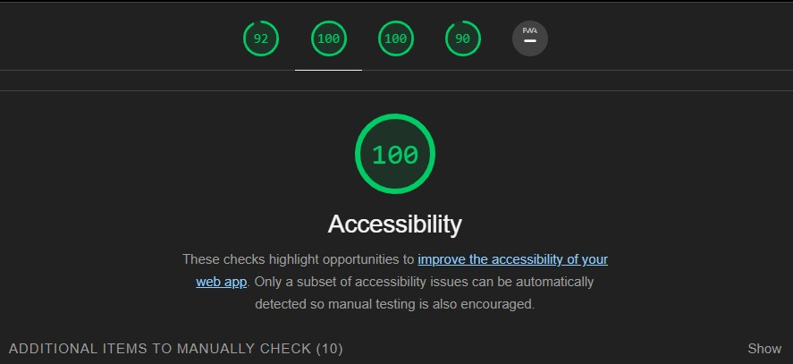
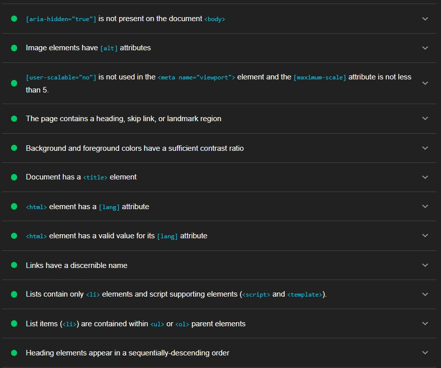
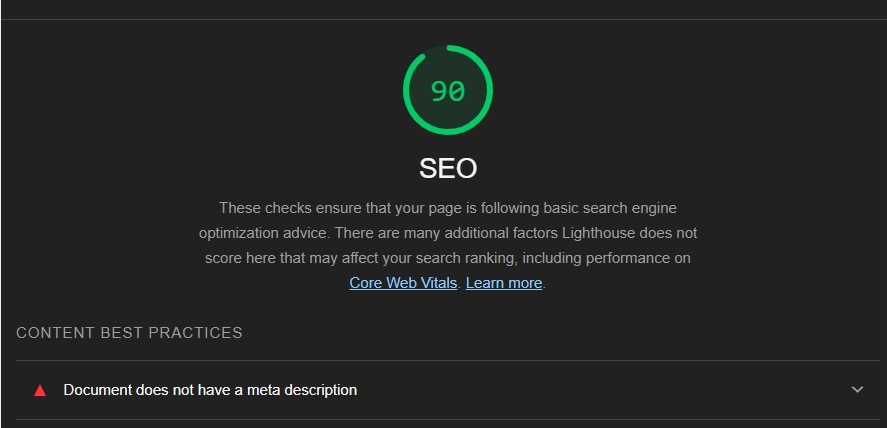
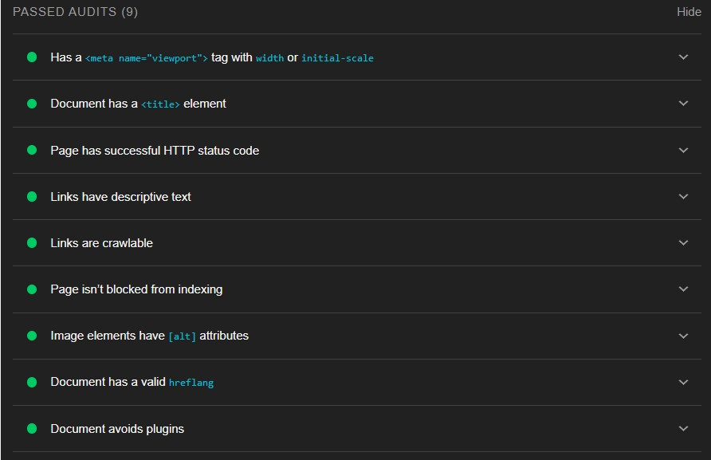

# m3-hw3-kuhn-shannon
# Screenshots of my Lighthouse audit results:
## Accessibility

I did not have to make any revisions to my code to improve accessibility.
## SEO

Per the results of my SEO audit, I added a meta description to my head element with a brief description of the content of my webpage. 